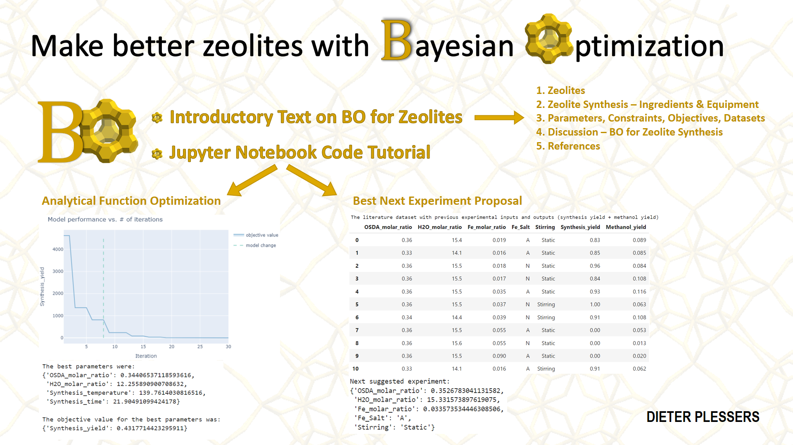

# Bayesian Optimisation for Zeolite Synthesis 

## Overview

## Scope
This repository was initiated as an entry for the [Bayesian Optimization Hackathon for Chemistry and Materials](https://ac-bo-hackathon.github.io/), held on March 27-28, 2024, and sponsored by the Acceleration Consortium and Merck KGaA. Here, we propose Bayesian optimization within the field of zeolite synthesis. This concept is also explained in a [short video](https://www.youtube.com/watch?v=4lFEUixwkE8).

Despite their significant industrial applications as catalysts, ion exchangers and adsorbents, the synthesis of zeolites predominantly relies on heuristics, experience and a sprinkle of magic.  Employing Bayesian optimization has the potential to swiftly navigate the extensive parameter space in zeolite synthesis research and reduce associated costs.

## [Introductory text](./zeolite_synthesis_bo_introduction.md) on zeolites, zeolite synthesis and Bayesian optimization
In [zeolite_synthesis_bo_introduction.md](./zeolite_synthesis_bo_introduction.md) we provide an overview of the following topics:
1. **Zeolites:** definition, properties and relevance in industry
2. **Zeolite Synthesis:** typical procedures, ingredients and equipments
3. **Zeolite Synthesis Optimization:** the limited literature on active learning for zeolite synthesis is discussed, and considerations regarding BO:  
   3.1 Parameter space of a zeolite synthesis  
   3.2 Constraints of a zeolite synthesis  
   3.3 Objectives that might be pursued in zeolite synthesis  
   3.4 Zeolite synthesis datasets that are available in literature  
4. **Discussion:** various aspects of BO in zeolite synthesis are discussed, and how they can be tackled
5. **References**

While numerous references are provided for further exploration, this document is self-contained and aims to be easily understood. We hope it inspires the reader to consider active learning approaches in their zeolite synthesis endeavors. 
This introductory text is also provided as [pdf](./zeolite_synthesis_bo_introduction.pdf).

## [Notebook](./demo_zeolite_synthesis_bo.ipynb) tutorial on Bayesian optimization for zeolite synthesis (with [Ax](https://ax.dev/)) 
Within the [demo_zeolite_synthesis_bo.ipynb](./demo_zeolite_synthesis_bo.ipynb) notebook, we illustrate the concepts of the introductory text with code, leveraging real-world literature data acquired through grid search in [Table S4](https://pubs.acs.org/doi/suppl/10.1021/acs.chemmater.9b03738/suppl_file/cm9b03738_si_001.pdf#page=10) and [Table S3](https://pubs.acs.org/doi/suppl/10.1021/jacs.1c07590/suppl_file/ja1c07590_si_001.pdf#page=9) in the Supporting Information of respectively [*Chem. Mater.* **2020**, *32*, 273–285](https://pubs.acs.org/doi/abs/10.1021/acs.chemmater.9b03738) and [*J. Am. Chem. Soc.* **2021**, *143*, 16243–16255](https://pubs.acs.org/doi/10.1021/jacs.1c07590).  

This notebook is divided into two sections:
1. The first section uses Bayesian optimization to **optimize an analytical dummy function** using zeolite synthesis parameters, showing a significant improvement compared to grid search.
2. The second section uses Bayesian optimization to **propose a new experiment** based on existing literature data.

A common overarching objective in zeolite synthesis is to achieve a **high yield** of the desired zeolite product. In the papers under consideration, a more specialized goal involves **maximizing the presence of proximal Al pairs** within synthesized CHA zeolites, which is required for stabilizing Fe2+ sites (so-called divalent cation capacity, DCC). Upon activation, these sites can selectively oxidize methane to **methanol**. Accordingly, we will provide examples with synthesis yield, DCC and methanol yield as optimization objectives for the Bayesian optimization process.

The various examples touch upon different aspects of Bayesian optimization, including **continuous variables, categorical variables, mixed variable types, parameter constraints, as well as single and multiple objectives**.

