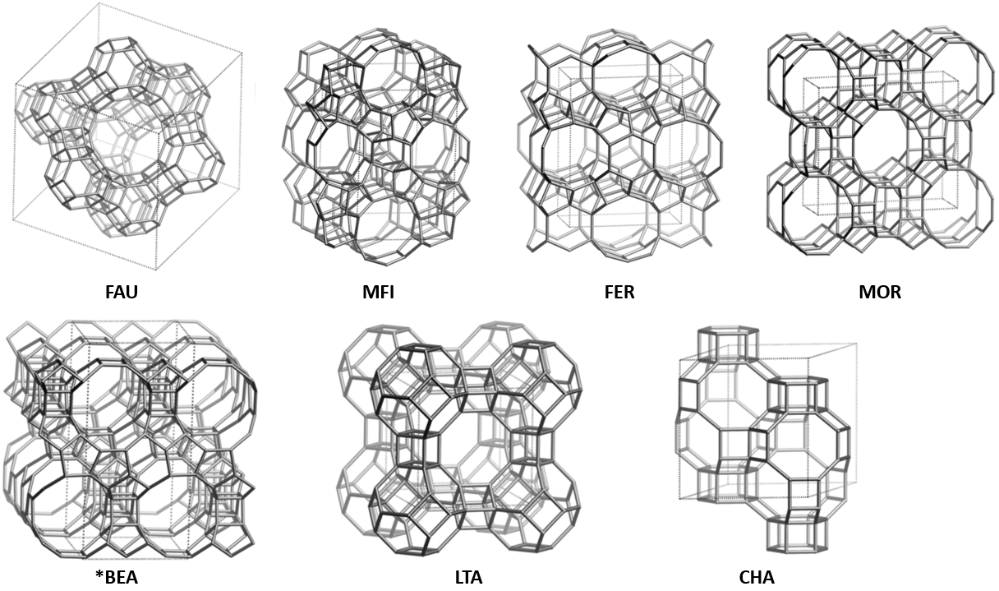
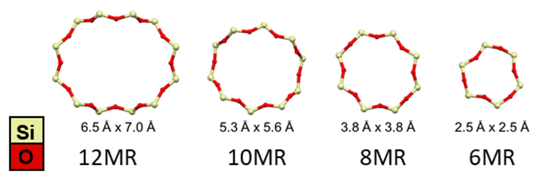
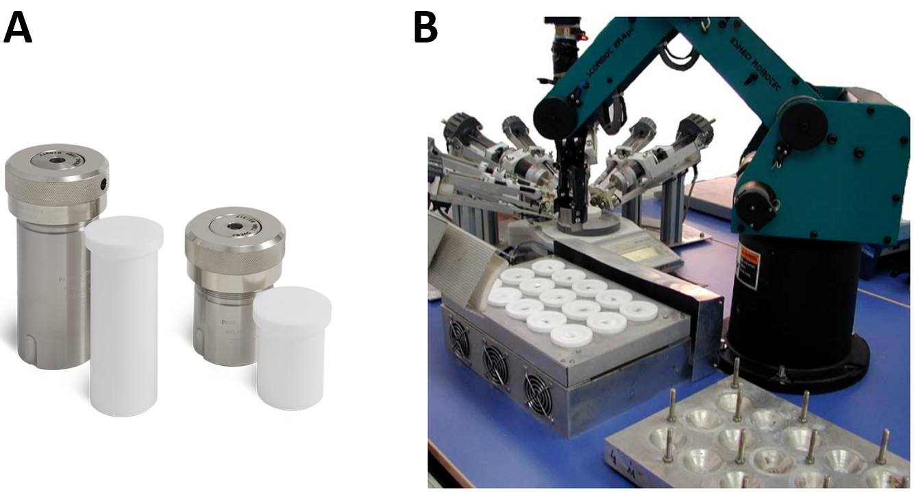

# Navigating black box zeolite synthesis with Bayesian optimization

Author: Plessers Dieter  
March 28th, 2024  
*Department of Microbial and Molecular Systems, Center for Sustainable Catalysis and Engineering, KU Leuven-University of Leuven, Belgium.*

## 0. Scope

This introductory document proposes the integration of active learning techniques such as Bayesian optimization into zeolite synthesis research. We first provide an overview of zeolites and their importance. Subsequently, we explore the standard components of zeolite synthesis experiments, including reagents, equipment, and conditions. We then delve into the potential of Bayesian optimization to accelerate zeolite synthesis experiments and reduce associated costs. The optimization problem addressed by Bayesian optimization is outlined, detailing a typical parameter space with tunable variables and constraints, along with possible objectives derived from a target application. Additionally, we briefly highlight a few zeolite synthesis datasets that recently have been compiled from literature. The final discussion section further elaborates on various facets of the Bayesian optimization process and introduces a specific coding example with real-world data, provided in the [accompanying Jupyter notebook](./demo_zeolite_synthesis_bo.ipynb).

While numerous references are provided for further exploration, this document is self-contained and aims to be easily understood. We hope it inspires the reader to consider active learning approaches in their zeolite synthesis endeavors.

## 1. Zeolites – Microporous Materials

Zeolites are porous, crystalline aluminosilicates built from linked \[SiO4\] and \[AlO4\]\- tetrahedra in which every oxygen atom is shared between neighboring Si or Al atoms (i.e. T-atoms).[^1][^2][^3] These T-atoms are arranged together in secondary building units (SBUs), that are connected and form a three-dimensional framework with channels and cages. The existence of multiple SBUs and numerous ways to connect them results in a theoretical enormous amount of zeolite topologies.[^4] Topologies observed experimentally or in nature are represented by a three letter code (e.g. FAU for faujasite, CHA for chabazite). All known zeolite topologies can be found on the website of the International Zeolite Association (IZA).[^5] As of March 2024, the website lists 256 distinct topologies, excluding intergrowths. The unique ring, pore and channel system of each zeolite topology determines their potential applications. Figure 1 illustrates the topologies of the most relevant commercial zeolites.

**Figure 1.** Framework structures of the most relevant zeolite topologies. Vertices represent T atoms (usually Si and Al) connected via O-atoms (not depicted)*.* Dashed lines demarcate the unit cells. All figures are sourced from the online IZA Database.[^5]

Pore and channel dimensions, typically in the ångström scale, are characterized by the number *n* of T-atoms in the limiting ring, denoted as *n*MR (*n*\-membered ring) (Figure 2). Ring sizes vary from 3MR to 24MR, and exhibit various shapes, from circular to elliptical.[^5][^6] This ring and channel system enables zeolites to function as molecular sieves, allowing only molecules smaller than the free diameter to traverse the rings, while larger molecules are excluded.[^1][^2] Zeolites are also known for their shape selectivity, wherein the distribution of products in a reaction system is influenced by how reactants, intermediates, and products fit within the cage and channel structure of the zeolites.[^7] Moreover, atoms beyond the first coordination sphere can impact the reactivity of active sites by guiding substrate approach and/or by (de)stabilizing the active site or transition state. These effects, known as 'second-sphere effects' play a crucial role in zeolite reactivity.[^8][^9]

**Figure 2.** Different ring sizes in zeolites.[^9][^10]

A specific zeolite topology is defined by the spatial arrangement of its lattice, regardless of the material’s chemical composition. Consequently, even within materials sharing the same zeolite topology, numerous parameters remain adjustable. Among these, the most prevalent is the amount and distribution of aluminum (Al) atoms within the zeolite lattice. Each \[AlO4\]\- tetrahedron introduces one negative lattice charge, which is counterbalanced by exchangeable, extra-framework cations. These cations can be protons, imparting zeolites with their distinctive acidic properties,[^11] or metal cations such as transition metal ions (TMIs), employed in redox reactions.[^9] They can also be combined in bifunctional catalysis.[^12]

Thanks to their thermal stability, low cost (particularly for commercially available bulk zeolites like depicted in Figure 1) and unique chemical properties (acidity, cation exchange capacity, molecular sieving capabilities…), zeolites find extensive use across various industrial sectors. They are integral components in detergents (such as washing powders), they serve as adsorbents and desiccants,[^13] and they play critical roles in petrochemistry, notably as acid catalysts in the fluid catalytic cracking (FCC) process.[^14] Beyond these applications, zeolites demonstrate remarkable versatility, being employed in sensors,[^15] membranes[^16] and redox processes, such as the removal of nitrogen-containing exhaust gases where Cu-exchanged CHA zeolites are at the forefront of selective catalytic reduction (SCR) of NOx gasses in vehicles.[^17][^18] The vast applicability of zeolites is evidenced by their annual production of approximately 6 million tons, with a global market valued at around 13 billion USD.[^19]

In addition to their extensive industrial applications, the favorable properties of zeolites guarantee their continued significance in fundamental research, both within academia and industry. Zeolites persist as one of the most extensively studied materials for various innovative applications, with numerous laboratories worldwide striving to optimize the synthesis process, customize the resulting properties of zeolites, and discover new topologies.[^20]

## 2. Zeolite Synthesis – Ingredients and Equipment

The zeolite synthesis research field boasts a rich history,[^21] reflected in the abundance of literature detailing various synthesis recipes for each zeolite topology (and different materials within the topology). These recipes span from straightforward methods with minimal ingredients, resilient to experimental errors, to intricate procedures demanding specialized equipment.[^22] Typically, hydrothermal synthesis methods are employed, involving the mixing of precursors in water followed by crystallization under elevated temperature and pressure conditions.

A ‘typical’ hydrothermal zeolite synthesis procedure involves combining a silicon source, an aluminum source, an organic structure-directing agent (OSDA) serving as a template to fill the zeolite pores during synthesis (afterwards removed via calcination), inorganic cations (typically alkali metal hydroxides) and water.[^22] These ingredients are mixed within an inert Teflon liner and placed inside a stainless steel autoclave (Figure 3A), which is quite literally a black box for which it is hard to understand, let alone predict, the internal processes.[^23] The synthesis occurs at autogenous pressure in an oven maintained at a certain temperature (typically 100-200°C) for a specific time (typically 3-7 days, though durations may vary). The synthesis can occur under stirring conditions using a magnetic stirring bar within the Teflon liner, by tumbling the autoclave in the oven, or under static conditions without agitation. An optional step prior to hydrothermal synthesis involves stirring the synthesis solution or gel for a period (often a day) at room temperature, known as ‘aging’.

However, the term ‘typical zeolite synthesis’ is somewhat contradictory since there are numerous variations on this process. While the aforementioned ingredients are common, they are not strictly required. Additionally, many other components could be introduced, such as fluoride as a mineralizer, alternative metals (e.g. B, Fe, Zn) for lattice incorporation alongside or in place of aluminum, a secondary OSDA, or the application of ultrasound or microwaves during synthesis.[^22] Even applying a voltage with electrodes recently emerged as a novel possibility.[^24] However, most of these unconventional conditions are utilized for niche materials with limited industrial significance, often due to the exotic requirements of such conditions.

**Figure 3.** A) Teflon liners and corresponding autoclaves.[^25] B) Multi-autoclave system for high-throughput parallel experiments with a robotic arm.[^26]

This brief overview of zeolite synthesis highlights the vast parameter space involved and the ongoing challenge of fully understanding the crystallization mechanisms. Consequently, despite the significant industrial importance of zeolites, their synthesis predominantly relies on heuristic approaches, practitioner experience, and an element of serendipity. An experienced zeolite synthesis practitioner can narrow down this parameter space by drawing from literature and past experiences. For instance, they might opt for a fixed set of ingredients and consider a limited range of temperatures and concentrations. Within this confined search space, typically, either a grid search or a random search is conducted. This process can be arduous, especially considering the sensitivity of certain zeolite synthesis processes to small changes in conditions. Fortunately, in many laboratories, parallel experiments using small multi-autoclave synthesis systems accelerate this process (Figure 3B).[^26] Figure 3B also offers a glimpse into a future with fully autonomous systems, where robots handle synthesis solution preparation, oven transfer, and synthesis product characterization. When integrated with ‘intelligent’ experimental design techniques like active learning, such as Bayesian optimization, this advancement could pave the way for the development of self-driving laboratories, drastically enhancing the pace of discovery and optimization in zeolite synthesis.[^27]

## 3. Zeolite Synthesis – Optimization

As discussed in the previous section, active learning has the potential to navigate the extensive parameter space of black box zeolite syntheses. This would prove beneficial in both manual and self-driving laboratories, saving time, reducing associated costs, and increasing the likelihood of discovering materials that are close to optimal.

Nonetheless, conducting a search on Science Direct and Google Scholar using the terms "zeolite Bayesian optimization" and "zeolite active learning" yields only a limited number of relevant examples, excluding cases where active learning is employed to optimize machine learning model hyperparameters:

1. Bayesian optimization was employed to experimentally find optimal Si/Al and Cu loading for Cu-CHA zeolites to optimize catalytic activity and selectivity in the partial oxidation of methane to methanol. As the CHA zeolites were commercially purchased, the Si/Al ratio was limited to 4 possibilities (categorical), whereas the in-house Cu ion exchange allowed for a continuous range of Cu loading.[^28]
2. Bayesian optimization was employed to experimentally determine the optimal metal loading of Cu/Fe-CHA catalysts, aiming to maximize their performance in both fresh and hydrothermally aged conditions for the selective catalytic reduction of NOx in diesel engine exhaust.[^29]
3. Bayesian optimization was used to find mechanically superior zeolite structures (in term of shear and bulk moduli calculated with DFT and machine learning) in an existing database containing approximately 590,000 hypothetical zeolites.[^30]

However, none of these examples directly relate to zeolite synthesis. The first example effectively illustrates how an optimized in-house synthesis could lead to further improvement of the catalyst. This would involve expanding the feasible range of Si/Al values and considering additional variables such as synthesis temperature and duration, which can impact Al distribution. Thus, it appears that the zeolite synthesis field with its associated large parameter space could benefit from leveraging active learning methods. Therefore, the optimization characteristics are explored below, building upon the earlier section detailing zeolite synthesis ingredients and equipment.

### 3.1 Parameter Space

Zeolite synthesis involves numerous inherently **continuous** variables, such as the concentrations of the aforementioned ingredients. Typically, syntheses are presented in literature as molar ratio *xi* of ingredient *i* with respect to silicon, e.g., 1 Si: 0.1 Al: 0.5 OSDA: 0.2 Na+: 30 H2O. Given the known synthesis volume in the teflon liner, these ratios determine the required ingredient masses. Consequently, in Bayesian optimization, it is sufficient to optimize the molar ratio values. Other continuous variables include synthesis temperature, duration, and stirring/tumbling speed.

The parameter bounds encompass reasonable molar ratio values (ranging from a lower bound of 0 to upper bounds determined by the ingredient and target, such as *xAl* < 0.5), along with constraints linked to equipment specifications. These constraints may include the maximum temperature of the synthesis oven and the predefined maximum speeds for stirring and tumbling systems. Depending on the equipment at hand, certain continuous variables may need to be discretized. For instance, in a setup where only one tumbling speed is available, the tumbling variable would become categorical: {Yes, No}.

On the other hand, the selection of precursor materials is **categorical**. Even though the difference between certain sources seems minimal, they could have a small difference in solubility or basicity and lead to different crystallization kinetics.[^31]

Below, we list several standard choices for the typical hydrothermal synthesis outlined above:

| **Precursor** | **Options** |
| --- | --- |
|     |     |
| Silicon | Colloidal (Ludox HS-40, Ludox AS-40…), fumed (aerosil, Cab-O-Sil…), solid (sodium silicates, other zeolites in an interzeolite conversion…), liquids (tetraethyl orthosilicate…) … |
| Aluminum | Aluminum metal, Al(OH)3, Al(NO3)3, Al2(SO4)3, NaAlO2… |
| OSDA | Typically one to a few OSDAs are known to effectively template the pores of a specific zeolite topology. For example, the typical OSDA for CHA synthesis is N,N,N-trimethyladamantylammonium hydroxide, but alternatives like tetraethylammonium hydroxide have also been documented.[^32] However, most often, a fixed OSDA is chosen a priori, and other variables are adjusted, as syntheses with different OSDAs may require entirely different conditions. |
| Inorganic cation | LiOH, NaOH, KOH, CsOH, NaCl… |
| Water | Demineralized water is preferred for reproducibility, and further filtration (e.g., Milli-Q purification) is desirable. Therefore, no choices are to be made in this regard. |

### 3.2 Constraints

In zeolite synthesis, additional constraints on top of the specified bounds for the parameter space are uncommon. For instance, one might envision rare scenarios where both Al and a small amount of B are desired in the synthesis. Then a constraint could be introduced, e.g.: 10*xB* < *xAl*. Another scenario might involve limiting the total synthesis cost by assigning a monetary value to each parameter.

### 3.3 Objectives

Various objectives might be pursued depending on the economic considerations of the process and the specific application requirements:

**General objectives:**

- Attaining high crystallinity of the resulting zeolite.
- Ensuring high purity by minimizing the presence of side-products.

**Economic objectives:**

- Achieving a high synthesis yield.
- Maintaining low concentrations of expensive ingredients such as the organic structure-directing agent (OSDA), or other potentially harmful ingredients like fluoride.
- Operating at low synthesis temperatures.
- Reducing the synthesis time.

**Application objectives:**

- Targeting specific Si/Al ratios, which might be important for acid-catalyzed applications and also influences the zeolite stability.[^33]
- Controlling the distribution of aluminum within the structure, important for ion exchange and catalysis.[^34]
- Adjusting crystal size or morphology to optimize catalysis, adsorption or separation applications.[^35]

Most of these objectives are correlated in positive or negative ways. For instance, low crystal size is generally accomplished through lower synthesis temperatures, favoring nucleation over crystal growth. However, this also results in slow nucleation and crystal growth and – depending on the synthesis time – low yields.[^36]

### 3.4 Zeolite Synthesis Datasets

Most zeolite synthesis papers include tables, either in the main text or supplementary information, that contain the molar ratios of the ingredients used in the ‘grid search’ synthesis experiments. The exact procedure and details of the ingredients are often described in textual form in the method sections. Following the recent advancements in material informatics, some studies have systematically scraped and summarized zeolite synthesis data. The data can be combined with structural parameters available on the IZA website for the respective topologies.[^5]

Jensen et al. gathered data for 1,200 distinct synthetic pathways for Ge-containing zeolites[^37] and 5,663 synthesis routes specifying OSDAs.[^38] Muraoka et al. compiled a dataset with 686 unique OSDA-free synthesis routes for 23 distinct frameworks, detailing gel compositions and reaction conditions.[^39] However, these datasets are rather small and do not fully encapsulate all parameters essential for zeolite synthesis: synthesis composition, OSDA and reaction conditions.

In a recent impressive development, Pan et al. introduced ZeoSyn, a comprehensive dataset containing 23,961 zeolite synthesis pathways for 233 distinct zeolite topologies, representing over 80% of synthesized frameworks to date, using 921 unique OSDAs.[^40] Each synthesis route details gel composition (a combination of 51 possible ingredients, including Si, Al, P, Na+, K+, OH−, F−, Ge, Ti, B, OSDA, H2O and additional solvents), reaction conditions and the resulting zeolite structure (or absence thereof, e.g. formation of dense or amorphous phases). In some cases, resulting zeolite properties such as Si/Al ratio, crystal size, crystallinity and BET surface area are reported. Each synthesis pathway is cross-referenced with the corresponding article from which it was sourced, alongside its publication year. The dataset is available on GitHub.[^41]

## 4. Discussion

Despite the significant industrial importance of zeolites, their synthesis primarily relies on heuristic approaches, domain knowledge, and a degree of serendipity. An experienced researcher can narrow down the extensive zeolite synthesis parameter space by drawing from literature and past experiences. Typically, within this constrained search space, practitioners resort to either a grid search or a random search. However, this procedure can prove time-consuming and costly. Active learning techniques, such as Bayesian optimization, offer the potential to more efficiently navigate the parameter space of black box zeolite syntheses and increase the likelihood of discovering materials that are close to optimal.

Zeolite synthesis involves numerous continuous and categorical variables (see the Zeolite Synthesis sections). Depending on the considered search space, **mixed variable type** Bayesian optimization becomes necessary.[^42][^43] Additionally, many syntheses are **multi-objective**;[^44] for example, researchers may seek high synthesis yield coupled with a small crystal size. As mentioned earlier, laboratories often conduct parallel experiments using small multi-autoclave synthesis systems. Such setups could benefit from **batch** Bayesian optimization, which involves evaluating multiple candidate solutions simultaneously in each iteration of the optimization process. This can potentially reduce the total number of iterations required to find the desired solution.[^45][^46]

One advantage of the extensive history of zeolite synthesis is the abundance of recipes available for most interesting topologies. Furthermore, unlike many other fields, failed synthesis attempts are frequently documented in the literature.[^40] Optimization campaigns enriched by **knowledge transfer** from past campaigns could identify desired materials with fewer experiments.[^47]

Nowadays, various packages, such as Ax[^48], BayBE[^49] and scikit-optimize[^50]…, readily provide access to these different aspects of Bayesian optimization. In the [accompanying Jupyter notebook](./demo_zeolite_synthesis_bo.ipynb), we illustrate these features using real-world literature data.[^51][^52] One of the objectives of these studies was to maximize the amount of proximal Al pairs in synthesized CHA zeolites, which is required for stabilizing Fe2+ sites. Upon activation, these sites can selectively oxidize methane to methanol. The importance of these proximal Al pairs is underscored by the fact that in Cu-CHA zeolites, conversely, a low concentration of proximal Al pairs is preferred. In this context, these proximal Al pairs stabilize redox-inactive Cu2+ species that do not participate in the oxidation of methane to methanol.[^53][^54] 

Two approaches are followed in the notebook:
1) Optimization of a simulated analytical target function based on synthesis parameters.
2) Existing literature data is fed as prior experimental data to the Bayesian optimization algorithm, which then recommends subsequent experimental conditions to try out.

This [code demonstration](./demo_zeolite_synthesis_bo.ipynb) showcases the effectiveness of Bayesian optimization in zeolite synthesis, hopefully encouraging the exploration of active learning approaches in similar endeavors. 

## References

[^1]: Davis, M. E. Zeolites and Molecular Sieves: Not Just Ordinary Catalysts. [*Ind. Eng. Chem. Res.* **1991**, *30*, 1675–1683.](https://doi.org/10.1021/ie00056a001)

[^2]: Flanigen, E. M. Chapter 2 - Zeolites and Molecular Sieves an Historical Perspective. In *Studies in Surface Science and Catalysis*; Van Bekkum, H., Flanigen, E. M., Jacobs, P. A., Jansen, J. C., Eds.; [Elsevier Science B.V., 2001; Vol. 137, pp 11–35.](https://doi.org/10.1016/S0167-2991(01)80243-3)

[^3]: Dusselier, M.; Davis, M. E. Small-Pore Zeolites: Synthesis and Catalysis. [*Chem. Rev.* **2018**, *118*, 5265–5329.](https://doi.org/10.1021/acs.chemrev.7b00738)

[^4]: Pophale, R.; Cheeseman, P. A.; Deem, M. W. A Database of New Zeolite-like Materials. [*Phys. Chem. Chem. Phys.* **2011**, *13*, 12407–12412.](https://doi.org/10.1039/C0CP02255A)

[^5]: Structure Commission of the International Zeolite Association. Database of Zeolite Structures. <http://www.iza-structure.org/databases/>.

[^6]: Baerlocher, C.; McCusker, L. B.; Olson, D. H. [*Atlas of Zeolite Framework Types*; Elsevier, 2007.](https://www.sciencedirect.com/book/9780444530646/atlas-of-zeolite-framework-types)

[^7]: Csicsery, S. M. Shape-Selective Catalysis in Zeolites. [*Zeolites* **1984**, *4*, 116–126.](https://doi.org/10.1016/0144-2449(84)90024-1)

[^8]: Snyder, B. E. R.; Vanelderen, P.; Schoonheydt, R. A.; Sels, B. F.; Solomon, E. I. Second-Sphere Effects on Methane Hydroxylation in Cu-Zeolites. [*J. Am. Chem. Soc.* **2018**, *140*, 9236–9243.](https://doi.org/10.1021/jacs.8b05320)

[^9]: Snyder, B. E. R.; Bols, M. L.; Schoonheydt, R. A.; Sels, B. F.; Solomon, E. I. Iron and Copper Active Sites in Zeolites and Their Correlation to Metalloenzymes. [*Chem. Rev.* **2018**, *118*, 2718–2768.](https://doi.org/10.1021/acs.chemrev.7b00344)

[^10]: Plessers, D.; Bols, M. L.; Rhoda, H. M.; Heyer, A. J.; Solomon, E. I.; Sels, B. F.; Schoonheydt, R. A. Single Site Spectroscopy of Transition Metal Ions and Reactive Oxygen Complexes in Zeolites. [In *Comprehensive Inorganic Chemistry III*; Reedijk, J., Poeppelmeier, K. R., Eds.; Elsevier, 2023; pp 148–164.](https://doi.org/10.1016/B978-0-12-823144-9.00008-X)

[^11]: Derouane, E. G.; Védrine, J. C.; Ramos Pinto, R.; Borges, P. M.; Costa, L.; Lemos, M. A. N. D. A.; Lemos, F.; Ramôa Ribeiro, F. The Acidity of Zeolites: Concepts, Measurements and Relation to Catalysis: A Review on Experimental and Theoretical Methods for the Study of Zeolite Acidity. [*Catal. Rev. - Sci. Eng.* **2013**, *55*, 454–515.](https://doi.org/10.1080/01614940.2013.822266)

[^12]: Zhang, Q.; Gao, S.; Yu, J. Metal Sites in Zeolites: Synthesis, Characterization, and Catalysis. [*Chem. Rev.* **2023**, *123*, 6039–6106.](https://doi.org/10.1021/acs.chemrev.2c00315)

[^13]: Pérez-Botella, E.; Valencia, S.; Rey, F. Zeolites in Adsorption Processes: State of the Art and Future Prospects. [*Chem. Rev.* **2022**, *122*, 17647–17695.](https://doi.org/10.1021/acs.chemrev.2c00140)

[^14]: Yilmaz, B.; Müller, U. Catalytic Applications of Zeolites in Chemical Industry. [*Top. Catal.* **2009**, *52*, 888–895.](https://doi.org/10.1007/s11244-009-9226-0)

[^15]: Xu, X.; Wang, J.; Long, Y. Zeolite-Based Materials for Gas Sensors. [*Sensors* **2006**, *6*, 1751–1764.](https://doi.org/10.3390/s6121751)

[^16]: Rangnekar, N.; Mittal, N.; Elyassi, B.; Caro, J.; Tsapatsis, M. Zeolite Membranes - a Review and Comparison with MOFs. [*Chem. Soc. Rev.* **2015**, *44*, 7128–7154.](https://doi.org/10.1039/C5CS00292C)

[^17]: Beale, A. M.; Gao, F.; Lezcano-Gonzalez, I.; Peden, C. H. F.; Szanyi, J. Recent Advances in Automotive Catalysis for NOx Emission Control by Small-Pore Microporous Materials. [*Chem. Soc. Rev.* **2015**, *44*, 7371–7405.](https://doi.org/10.1039/C5CS00108K)

[^18]: Zhang, R.; Liu, N.; Lei, Z.; Chen, B. Selective Transformation of Various Nitrogen-Containing Exhaust Gases toward N2 over Zeolite Catalysts. [*Chem. Rev.* **2016**, *116*, 3658–3721.](https://doi.org/10.1021/acs.chemrev.5b00474)

[^19]: Zeolite Market Size, Share & Trends Analysis Report By Application (Catalyst, Adsorbent, Detergent Builder), By Product (Natural, Synthetic), By Region (North America, Europe, APAC, CSA, MEA), And Segment Forecasts, 2022 - 2030. ISBN 978-1-68038-601-1. <https://www.grandviewresearch.com/industry-analysis/zeolites-market>.

[^20]: Davis, M. E. Zeolites from a Materials Chemistry Perspective. [*Chem. Mater.* **2014**, *26*, 239–245.](https://doi.org/10.1021/cm401914u)

[^21]: Cundy, C. S.; Cox, P. A. The Hydrothermal Synthesis of Zeolites: History and Development from the Eearliest Days to the Present Time. [*Chem. Rev.* **2003**, *103*, 663–701.](https://doi.org/10.1021/cr020060i)

[^22]: Deneyer, A.; Ke, Q.; Devos, J.; Dusselier, M. Zeolite Synthesis under Nonconventional Conditions: Reagents, Reactors, and Modi Operandi. [*Chem. Mater.* **2020**, *32*, 4884–4919.](https://doi.org/10.1021/acs.chemmater.9b04741)

[^23]: Asselman, K.; Kirschhock, C.; Breynaert, E. Illuminating the Black Box: A Perspective on Zeolite Crystallization in Inorganic Media. [*Acc. Chem. Res.* **2023**, *56*, 2391–2402.](https://doi.org/10.1021/acs.accounts.3c00269)

[^24]: Ivanushkin, G.; Dusselier, M. Engineering Lewis Acidity in Zeolite Catalysts by Electrochemical Release of Heteroatoms during Synthesis. [*Chem. Mater.* **2023**, *35*, 5049–5058.](https://doi.org/10.1021/acs.chemmater.3c00552)

[^25]: Hydrothermal Synthesis. <https://www.parrinst.com/products/sample-preparation/acid-digestion/applications/hydrothermal-synthesis/>.

[^26]: Moliner, M.; Serra, J. M.; Corma, A.; Argente, E.; Valero, S.; Botti, V. Application of Artificial Neural Networks to High-Throughput Synthesis of Zeolites. [*Microporous Mesoporous Mater.* **2005**, *78*, 73–81.](https://doi.org/10.1016/j.micromeso.2004.09.018)

[^27]: Tom, G.; Schmid, S. P.; Baird, S. G.; Cao, Y.; Darvish, K.; Hao, H.; Lo, S.; Pablo-García, S.; Rajaonson, E. M.; Skreta, M.; Yoshikawa, N.; Corapi, S.; Akkoc, G. D.; Strieth-Kalthoff, F.; Seifrid, M.; Aspuru-Guzik, A. Self-Driving Laboratories for Chemistry and Materials Science. [*ChemRxiv* **2024**, doi:10.26434/chemrxiv-2024-rj946.](https://doi.org/10.26434/chemrxiv-2024-rj946)

[^28]: Ohyama, J.; Tsuchimura, Y.; Yoshida, H.; Machida, M.; Nishimura, S.; Takahashi, K. Bayesian-Optimization-Based Improvement of Cu-CHA Catalysts for Direct Partial Oxidation of CH4. [*J. Phys. Chem. C* **2022**, *126*, 19660–19666.](https://doi.org/10.1021/acs.jpcc.2c04229)

[^29]: Lim, S.; Lee, H.; Bae, S.; Shin, J. S.; Kim, D. H.; Lee, J. M. Bayesian Optimization for Automobile Catalyst Development. [In *14th International Symposium on Process Systems Engineering*; Elsevier, 2022; Vol. 49, pp 1213–1218.](https://doi.org/10.1016/B978-0-323-85159-6.50202-5)

[^30]: Kim, N.; Min, K. Accelerated Discovery of Zeolite Structures with Superior Mechanical Properties via Active Learning. [*J. Phys. Chem. Lett.* **2021**, *12*, 2334–2339.](https://doi.org/10.1021/acs.jpclett.1c00339)

[^31]: Liang, D.; Liu, Y.; Zhang, R.; Xie, Q.; Zhang, L. A Review on the Influence Factors in the Synthesis of Zeolites and the Transformation Behavior of Silicon and Aluminum During the Process. [*Comments Inorg. Chem.* **2024**, *00*, 1–37.](https://doi.org/10.1080/02603594.2024.2309878)

[^32]: Martín, N.; Moliner, M.; Corma, A. High Yield Synthesis of High-Silica Chabazite by Combining the Role of Zeolite Precursors and Tetraethylammonium: SCR of NOx. [*Chem. Commun.* **2015**, *51*, 9965–9968.](https://doi.org/10.1039/C5CC02670A)

[^33]: Li, J.; Gao, M.; Yan, W.; Yu, J. Regulation of the Si/Al Ratios and Al Distributions of Zeolites and Their Impact on Properties. [*Chem. Sci.* **2022**, *14*, 1935–1959.](https://doi.org/10.1039/D2SC06010H)

[^34]: Knott, B. C.; Nimlos, C. T.; Robichaud, D. J.; Nimlos, M. R.; Kim, S.; Gounder, R. Consideration of the Aluminum Distribution in Zeolites in Theoretical and Experimental Catalysis Research. [*ACS Catal.* **2018**, *8*, 770–784.](https://doi.org/10.1021/acscatal.7b03676)

[^35]: Li, S.; Li, J.; Dong, M.; Fan, S.; Zhao, T.; Wang, J.; Fan, W. Strategies to Control Zeolite Particle Morphology. [*Chem. Soc. Rev.* **2019**, *48*, 885–907.](https://doi.org/10.1039/C8CS00774H)

[^36]: Larsen, S. C. Nanocrystalline Zeolites and Zeolite Structures: Synthesis, Characterization, and Applications. [*J. Phys. Chem. C* **2007**, *111*, 18464–18474.](https://doi.org/10.1021/jp074980m)

[^37]: Jensen, Z.; Kim, E.; Kwon, S.; Gani, T. Z. H.; Román-Leshkov, Y.; Moliner, M.; Corma, A.; Olivetti, E. A Machine Learning Approach to Zeolite Synthesis Enabled by Automatic Literature Data Extraction. [*ACS Cent. Sci.* **2019**.](https://doi.org/10.1021/acscentsci.9b00193)

[^38]: Jensen, Z.; Kwon, S.; Schwalbe-Koda, D.; Paris, C.; Gómez-Bombarelli, R.; Román-Leshkov, Y.; Corma, A.; Moliner, M.; Olivetti, E. A. Discovering Relationships between OSDAs and Zeolites through Data Mining and Generative Neural Networks. [*ACS Cent. Sci.* **2021**, *7*, 858–867.](https://doi.org/10.1021/acscentsci.1c00024)

[^39]: Muraoka, K.; Sada, Y.; Miyazaki, D.; Chaikittisilp, W.; Okubo, T. Linking Synthesis and Structure Descriptors from a Large Collection of Synthetic Records of Zeolite Materials. [*Nat. Commun.* **2019**, *10*, 1–11.](https://doi.org/10.1038/s41467-019-12394-0)

[^40]: Pan, E.; Kwon, S.; Jensen, Z.; Xie, M.; Gómez-Bombarelli, R.; Moliner, M.; Román-Leshkov, Y.; Olivetti, E. ZeoSyn: A Comprehensive Zeolite Synthesis Dataset Enabling Machine-Learning Rationalization of Hydrothermal Parameters. [*ACS Cent. Sci.* **2024**.](https://doi.org/10.1021/acscentsci.3c01615)

[^41]: Pan, E.; Kwon, S.; Jensen, Z.; Xie, M.; Gómez-Bombarelli, R.; Moliner, M.; Román-Leshkov, Y.; Olivetti, E. ZeoSyn: A Comprehensive Zeolite Synthesis Dataset Enabling Machine-learning Rationalization of Hydrothermal Parameters (ACS Central Science 2024). <https://github.com/eltonpan/zeosyn_dataset>.

[^42]: Häse, F.; Aldeghi, M.; Hickman, R. J.; Roch, L. M.; Aspuru-Guzik, A. Gryffin: An Algorithm for Bayesian Optimization of Categorical Variables Informed by Expert Knowledge. [*Appl. Phys. Rev.* **2021**, *8*.](https://doi.org/10.1063/5.0048164)

[^43]: Aldulaijan, N.; Marsden, J. A.; Manson, J. A.; Clayton, A. D. Adaptive Mixed Variable Bayesian Self-Optimisation of Catalytic Reactions. [*React. Chem. Eng.* **2023**, 308–316.](https://doi.org/10.1039/D3RE00476G)

[^44]: Torres, J. A. G.; Lau, S. H.; Anchuri, P.; Stevens, J. M.; Tabora, J. E.; Li, J.; Borovika, A.; Adams, R. P.; Doyle, A. G. A Multi-Objective Active Learning Platform and Web App for Reaction Optimization. [*J. Am. Chem. Soc.* **2022**, *144*, 19999–20007.](https://doi.org/10.1021/jacs.2c08592)

[^45]: Häse, F.; Roch, L. M.; Kreisbeck, C.; Aspuru-Guzik, A. Phoenics: A Bayesian Optimizer for Chemistry. [*ACS Cent. Sci.* **2018**, *4*, 1134–1145.](https://doi.org/10.1021/acscentsci.8b00307)

[^46]: González, L. D.; Zavala, V. M. New Paradigms for Exploiting Parallel Experiments in Bayesian Optimization. [*Comput. Chem. Eng.* **2023**, *170*, 108110.](https://doi.org/10.1016/j.compchemeng.2022.108110)

[^47]: Hickman, R. J.; Ruža, J.; Tribukait, H.; Roch, L. M.; García-Durán, A. Equipping Data-Driven Experiment Planning for Self-Driving Laboratories with Semantic Memory: Case Studies of Transfer Learning in Chemical Reaction Optimization. [*React. Chem. Eng.* **2023**, *8*, 2284–2296.](https://doi.org/10.1039/D3RE00008G)

[^48]: Ax, Adaptive Experimentation Platform. <https://ax.dev/>.

[^49]: BayBE - A Bayesian Back End for Design of Experiments. <https://github.com/emdgroup/baybe>.

[^50]: Scikit-optimize, Sequential model-based optimization in Python. <https://scikit-optimize.github.io/stable/>.

[^51]: Devos, J.; Bols, M. L.; Plessers, D.; Goethem, C. Van; Seo, J. W.; Hwang, S.-J.; Sels, B. F.; Dusselier, M. Synthesis–Structure–Activity Relations in Fe-CHA for C–H Activation: Control of Al Distribution by Interzeolite Conversion. [*Chem. Mater.* **2020**, *32*, 273–285.](https://doi.org/10.1021/acs.chemmater.9b03738)

[^52]: Bols, M. L.; Devos, J.; Rhoda, H. M.; Plessers, D.; Solomon, E. I.; Schoonheydt, R. A.; Sels, B. F.; Dusselier, M. Selective Formation of α-Fe(II) Sites on Fe-Zeolites through One-Pot Synthesis. [*J. Am. Chem. Soc.* **2021**, *143*, 16243–16255.](https://doi.org/10.1021/jacs.1c07590)

[^53]: Pappas, D. K.; Borfecchia, E.; Dyballa, M.; Pankin, I. A.; Lomachenko, K. A.; Martini, A.; Signorile, M.; Teketel, S.; Arstad, B.; Berlier, G.; Lamberti, C.; Bordiga, S.; Olsbye, U.; Lillerud, K. P.; Svelle, S.; Beato, P. Methane to Methanol: Structure–Activity Relationships for Cu-CHA. [*J. Am. Chem. Soc.* **2017**, *139*, 14961–14975.](https://doi.org/10.1021/jacs.7b06472)

[^54]: Rhoda, H. M.; Plessers, D.; Heyer, A. J.; Bols, M. L.; Schoonheydt, R. A.; Sels, B. F.; Solomon, E. I. Spectroscopic Definition of a Highly Reactive Site in Cu-CHA for Selective Methane Oxidation: Tuning a Mono-μ-Oxo Dicopper(II) Active Site for Reactivity. [*J. Am. Chem. Soc.* **2021**, *143*, 7531–7540.](https://doi.org/10.1021/jacs.1c02835)
